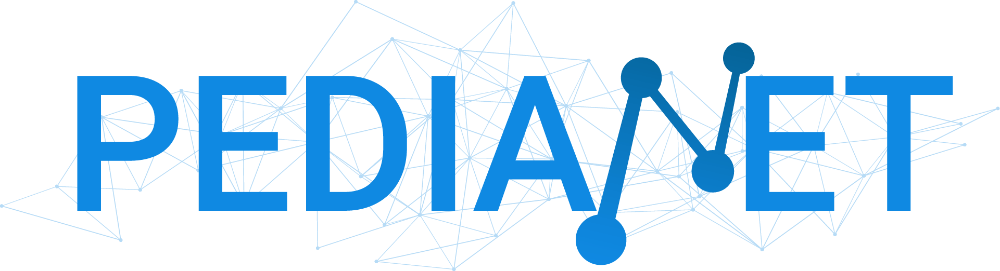
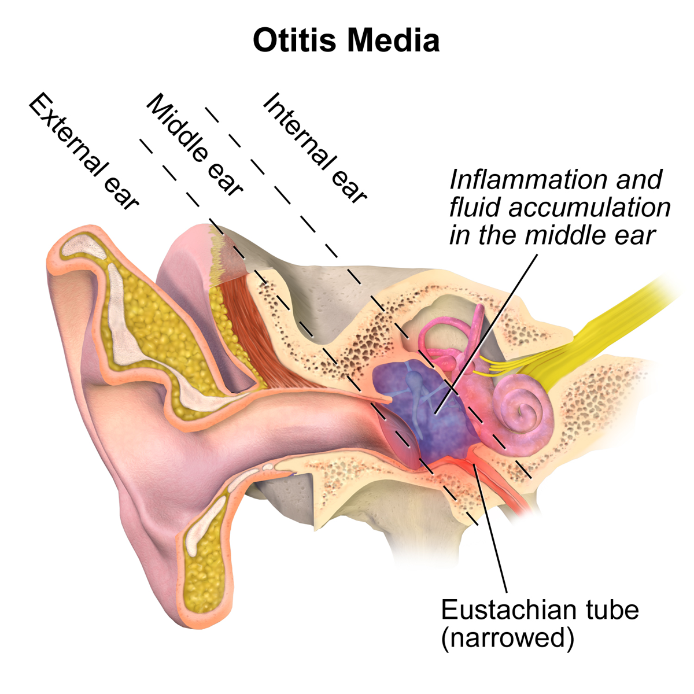
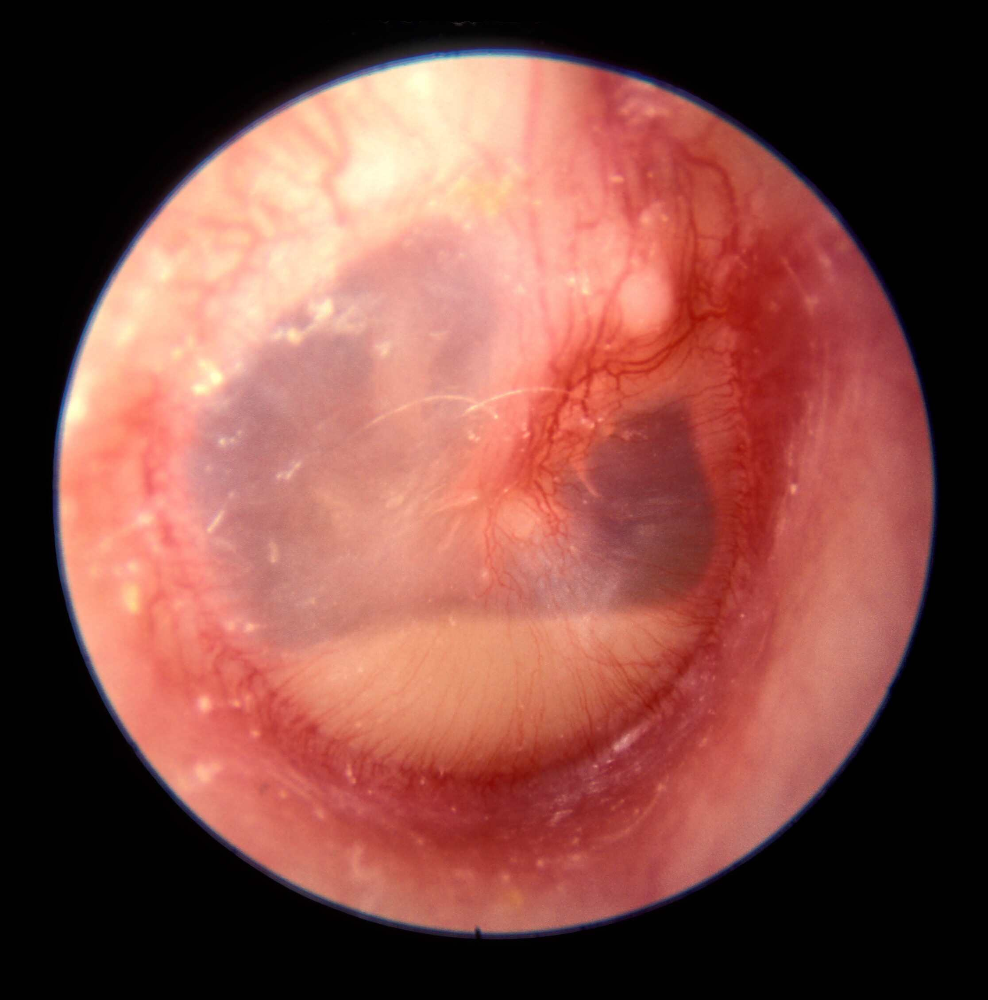
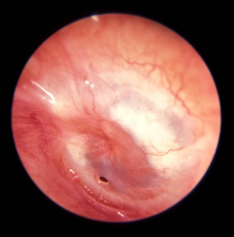
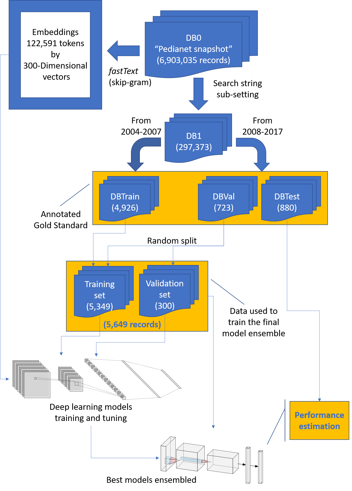
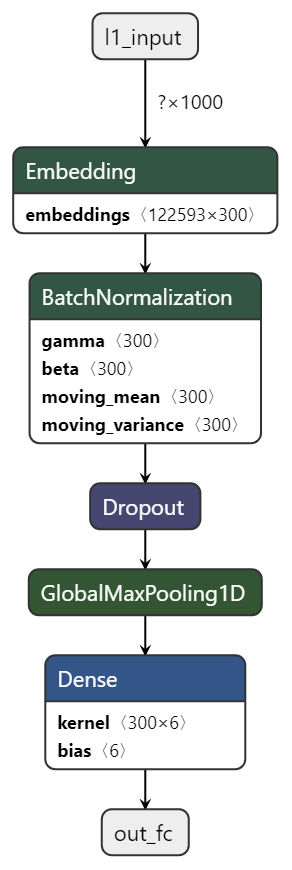
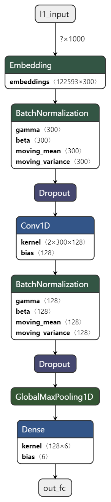
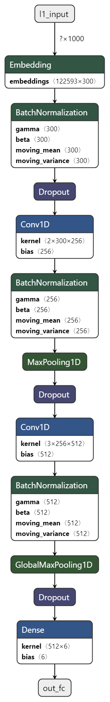
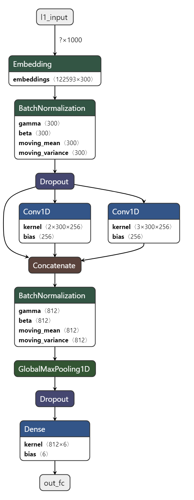
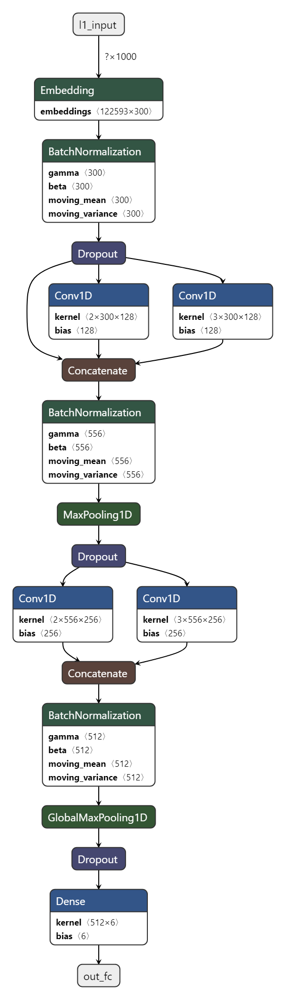

class: center, middle, and title-slide
background-image: url("images/bg.png")
background-position: top
background-size: contain

```{r setup, include=FALSE}
options(htmltools.dir.version = FALSE)
```

# Automatic identification and classification of different types of otitis from free-text pediatric medical notes in the Italian language: a deep-learning approach

**Corrado Lanera**\*<sup>1</sup>, Elisa Barbieri<sup>2</sup>, Gianluca Piras<sup>1</sup>, Arjun Maggie<sup>3</sup>, Davy Weissenbacher<sup>3</sup>, Daniele Dona<sup>2</sup>, Luigi Cantarutti<sup>4</sup>, Graciela Gonzalez<sup>3</sup>,<br>Carlo Giaquinto<sup>2,4</sup>, and Dario Gregori<sup>1</sup>

.left[
<small><small>\*<corrado.lanera@unipd.it><br><br></small></small>
2019/09/25 - HLP Center @UPenn
]


<br>
<br>

.left[
<small>
<small>
<small>
<small>
<sup>1</sup> Unit of Biostatistics, Epidemiology, and Public Health of the Department of Cardiac-Thoracic-Vascular Sciences and Public Health – University of Padova<br>
<sup>2</sup> Division of Pediatric Infectious Diseases, Department for Woman and Child Health, University of Padua, Padua, Italy<br>
<sup>3</sup> Health Language Processing Center, Institute for Biomedical Informatics of the Perelman School of Medicine – University of Pennsylvania<br>
<sup>4</sup> Società Servizi Telematici – Pedianet<br>
</small>
</small>
</small>
</small>
]


---
class: inverse, middle
# Outline

Overview: classification of otitis

Task: multi-class classification

Database:

Metrics: scores and human-performances

Project plan: flowchart

Deep-learning approach: architecture explored

Results

Conclusions


---
class: center, middle, inverse
# **Overview**<br>classification of otitis


---
class: middle

.pull-left[
one of the most common infections in pediatrics ...



<small><small><small><small>https://commons.wikimedia.org/wiki/File:Otitis_Media.png</small></small></small></small>
]

.pull-right[
... and the main cause of antibiotic prescriptions 

_[...] diagnosis is often challenging in everyday
practice because the symptoms are non-specific or
absent, and frequently little attention is paid to the
issued guidelines._

_[...] there has been a continuing interest in
defining the incidence and burden of AOM in different
populations, including those in which the offer and
coverage of heptavalent pneumococcal conjugate vaccine
has been considerably heterogeneous_*
]

.footnote[<small><small><small><small>\*Marchisio P. et al. "Burden of acute otitis media in primary care pediatrics in Italy: a secondary data analysis from the Pedianet database", **BMC Pediatrics** 2012.</small></small></small></small>]


---
class: center, middle, inverse
# **Task**<br>multi-class classification


---
class: middle

Based on data provided in the EHRs at the visit level, decide if it reports:

<small>
1. whatever other than an otitis case
1. an otitis case which is not media (whatever severity)
1. a media otitis which is not acute
1. 
  an AOM (w/o tympanic membrane perforation, nor recurrent)

1. 
  an AOM with tympanic membrane perforation
1. a recurrent AOM
</small>

.footnote[<small><small><small><small>http://otitismedia.hawkelibrary.com</small></small></small></small>]


---
class: center, middle, inverse
# **Database**<br>


---
class: middle


**snapshot considerd**: from 1st January 2004 to 23rd August 2017

**records**: $6,903,035$

**pediatricians**: $144$ (troughout Italy)

**children**: $216,976$

**fields** (all free-text, Italian-language):
  - diagnosis
  - signs-and-symptoms
  - diary
  - prescription
  - visit description
  - visit result

Investigated in 2012 by Barbieri E. et al. 2018\* on data from 2010 to
2015 for similar task **on primary diagnosis only**: adding even the 
diaries in a traditional manual human-driven analysis proved to be too
costly in terms both of person-time (years) and economic resources

It is necessary to develop a **accurate** system able to classify all
the Pedianet records **automatically** investigating **all the textual
fields** in the database.


---
class: center, middle, inverse
# **Metrics**<br>scores and human-performances


---
class: middle

Gold-standard definition:
  - two independent expert annotators (weighted Cohen''s Kappa = $0.89$)
  - one pediatrician specialized in infectious diseases decided on the differences:*

Expert annotators | Accuracy [%] | Balanced F1 [%]
:--------------: | :----------: | :-------------:
       A         |     95.91    |       93.47
       B         |     95.80    |       90.12


$\text{Accuracy} = \frac{|\text{true positives}|}{|\text{records}|}$

$\text{Balanced F1} = \frac{\text{balanced precision} * \text{balanced recall}}{\text{balanced precision} + \text{balanced recall}}$

$\text{Balanced precision} = \frac{\sum_{i\in\text{classes}}\frac{|\text{true positives in }i|}{|\text{labelled like }i|}}{|\text{classes}|}$

$\text{Balanced precision} = \frac{\sum_{i\in\text{classes}}\frac{|\text{true positives in }i|}{|\text{class }i|}}{|\text{classes}|}$


.pull-right[<small><small>
  *Performances reported for the test set.
</small></small>]


---
class: center, middle, inverse
# **Analysis plan**<br>flowchart


---
class: center, middle



---
class: center, middle, inverse
# **Deep-learning approach**<br>architecture explored


---
class: top








---
class: center, middle, inverse
# **Results**


---
class: middle

Network          | Balanced<br>precision | Balanced<br>recall |  Accuracy | Balanced<br>F1
---------------- | :-------------------: | :----------------: |  :------: | :------------:
Simple embedding |         84.51         |        68.63       |   81.70   |      75.75
single kernel    |         92.60         |       _91.87_      |   94.66   |     _92.23_
sequential CNN   |        _95.94_        |        81.26       |   93.64   |      87.99
parallel CNN     |       **96.95**       |       _94.78_      | **96.59** |    **95.86**
deep CNN         |       **96.38**       |       _93.36_      | **96.25** |    **94.85**
Ensemble<br>(w/o simple embeddings)|**97.03**|   _93.97_      | **96.59** |    **95.47**

.pull-right[
  \* **Bold face** = over the maximum <br>
  \* _italic_ = over the mean
]

  Annotators     | Balanced<br>precision | Balanced<br>recall |  Accuracy | Balanced<br>F1
:--------------: | :-------------------: | :----------------: |  :------: | :------------:
       A         |         91.70         |        95.30       |    95.91  |      93.47 
       B         |         96.33         |        84.66       |    95.80  |      90.12 
    (mean)       |        (94.02)        |       (89.98)      |   (95.86) |     (91.80)


---
class: center, middle, inverse
# **Conclusions**


---
class: middle

- Potential of deep learning models in identifying and classifying
  diagnosis from free text
  
- Could be adopted in other health care databases
- Can improve healthcare research limiting human errors and time
  speeding databases interrogations


---
class: center, middle, inverse
# **Final remarks**


---
class: middle, center

.pull-left[
# Strenghts
- embedding: no more needs to hand-crafting features
- deep learning:
  - automatical detection and modeling of non linearities and
    interactions
  - update models w/ new data
  - use pre-trained or merge multiple models
  - can take advantage of more data than shallow models
]

.pull-right[
# Weakness
- human-performance not based on professionals levels
- missing computational power (i.e, GPUs) for
  - Recurrent networks
  - BERT
  - XLNet
  - ...
]


---
class: center, middle, inverse
<br>
<br>

# **Thank you all<br>for the attention<br>the hospitality<br><br>and to have made all this possible!**<br><br><br> (Questions?)

<br>

<small><small><small>Slides created via the R package [**xaringan**](https://github.com/yihui/xaringan) powered by [remark.js](https://remarkjs.com), [**knitr**](http://yihui.name/knitr), and [R Markdown](https://rmarkdown.rstudio.com).
